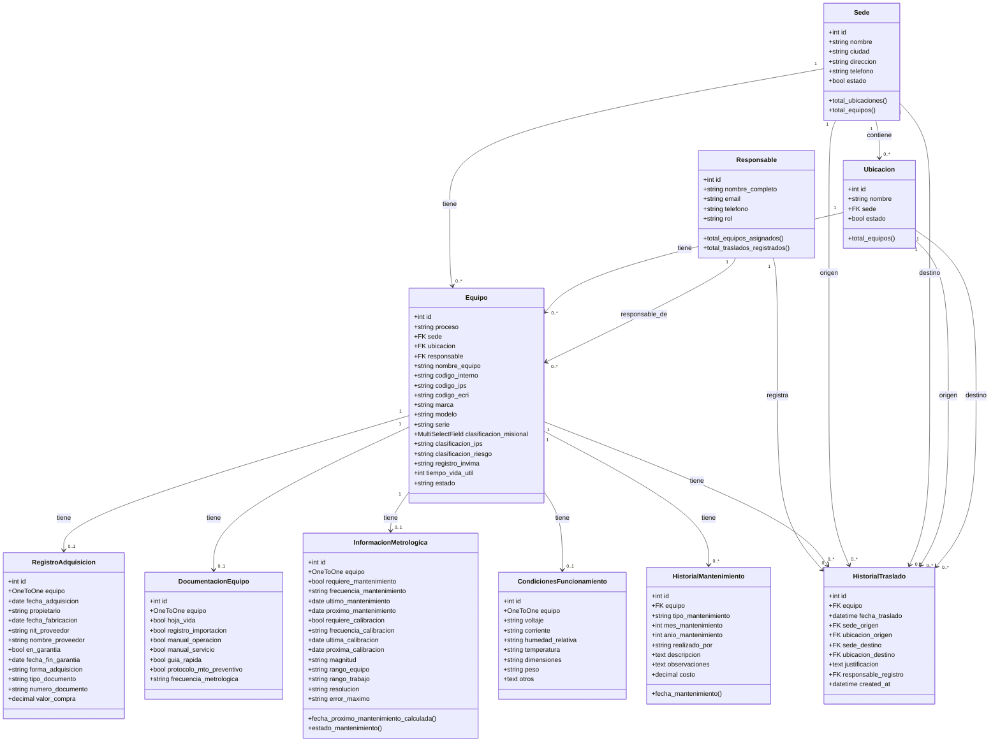
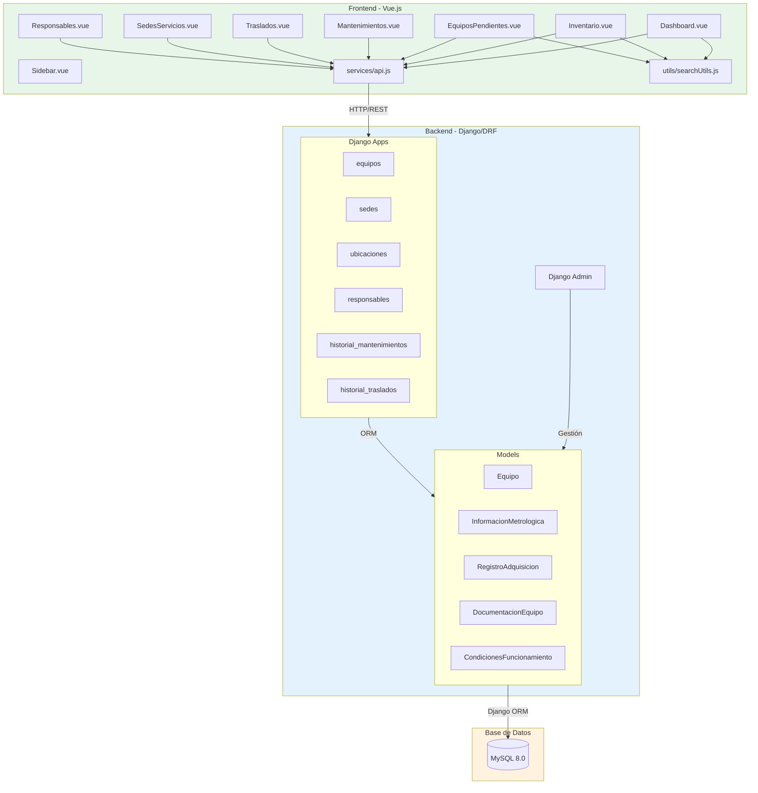
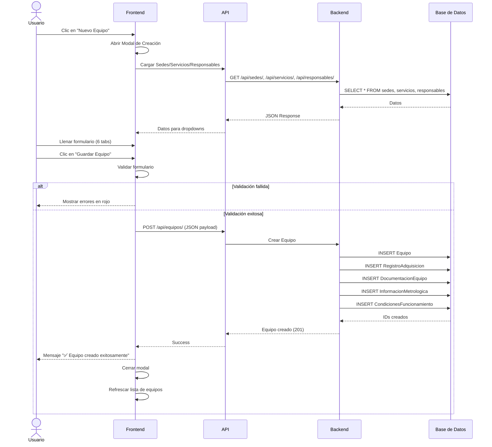

# Diagrama UML - Sistema LIME

## Diagrama de Clases del Backend

## Diagrama de Arquitectura del Sistema

## Diagrama de Flujo: Estados de Mantenimiento

## Diagrama de Secuencia: Crear Equipo

## Diagrama de Componentes: Frontend

```mermaid
graph TB
    subgraph Components["Componentes Vue"]
        App[App.vue]
        Sidebar[Sidebar.vue]
        Dashboard[Dashboard.vue]
        Inventario[Inventario.vue]
        Pendientes[EquiposPendientes.vue]
        Mantenimientos[Mantenimientos.vue]
        Traslados[Traslados.vue]
        SedesUbic[SedesServicios.vue]
        Responsables[Responsables.vue]
    end
    
    subgraph Services["Servicios"]
        API[api.js]
        EquiposAPI[equiposAPI]
        SedesAPI[sedesAPI]
        UbicacionesAPI[ubicacionesAPI]
        RespAPI[responsablesAPI]
        TrasladosAPI[trasladosAPI]
        MantenimientosAPI[mantenimientosAPI]
    end
    
    subgraph Utils["Utilidades"]
        SearchUtils[searchUtils.js]
        NormalizeText[normalizeText]
        FilterEquipos[filterEquiposBySearch]
    end
    
    App --> Sidebar
    App --> Dashboard
    App --> Inventario
    App --> Pendientes
    App --> Mantenimientos
    App --> Traslados
    App --> SedesUbic
    App --> Responsables
    
    Dashboard --> EquiposAPI
    Inventario --> EquiposAPI
    Inventario --> SedesAPI
    Inventario --> UbicacionesAPI
    Inventario --> RespAPI
    Pendientes --> EquiposAPI
    Mantenimientos --> MantenimientosAPI
    Traslados --> TrasladosAPI
    Traslados --> UbicacionesAPI
    SedesUbic --> SedesAPI
    SedesUbic --> UbicacionesAPI
    Responsables --> RespAPI
    
    Inventario --> SearchUtils
    Pendientes --> SearchUtils
    
    API --> EquiposAPI
    API --> SedesAPI
    API --> UbicacionesAPI
    API --> RespAPI
    API --> TrasladosAPI
    API --> MantenimientosAPI
    
    SearchUtils --> NormalizeText
    SearchUtils --> FilterEquipos
    
    style Components fill:#e8f5e9
    style Services fill:#e3f2fd
    style Utils fill:#fff3e0
```

## Notas Adicionales

### Convenciones de Nombres
- **Models**: PascalCase (Equipo, InformacionMetrologica)
- **Fields**: snake_case (codigo_interno, fecha_adquisicion)
- **Components**: PascalCase (Dashboard.vue, Inventario.vue)
- **Functions**: camelCase (normalizeText, filterEquiposBySearch)

### Relaciones Clave
1. **Sede → Ubicacion → Equipo**: Jerarquía organizacional (Servicio fue reemplazado por Ubicacion)
2. **Equipo → 4 modelos 1:1**: Información extendida
3. **Equipo → N historiales**: Trazabilidad temporal
4. **InformacionMetrologica**: Lógica crítica de estados
5. **Responsable → Equipo**: Asignación de responsables a equipos
6. **Responsable → HistorialTraslado**: Registro de quién realizó el traslado

### Estados del Sistema
- **Equipos**: Activo, Inactivo, Baja, En Mantenimiento
- **Mantenimiento**: Vencido, Próximo, Normal, No Requiere, No Programado
- **Tipo Mantenimiento**: Preventivo, Correctivo, Calibración, Verificación

### Flujos Principales
1. **Dashboard → EquiposPendientes**: Ver equipos que requieren atención
2. **Inventario → Modal Detalle**: Ver información completa
3. **Inventario → Modal Edición**: Modificar equipo
4. **SedesServicios → Acordeón**: Gestionar estructura organizacional (ahora con Ubicaciones)
5. **Traslados**: Registrar movimientos de equipos entre ubicaciones

### Cambios Recientes en el Esquema
- **Eliminado**: Tabla `Servicio` y campo `ubicacion_fisica` en Equipo
- **Agregado**: Tabla `Ubicacion` con FK a Sede
- **Agregado**: Campo `proceso` en Equipo (CharField)
- **Modificado**: Campo `ubicacion` en Equipo (ahora FK a Ubicacion)
- **Modificado**: Campo `usuario_registro` en HistorialTraslado (ahora `responsable_registro` como FK a Responsable)
- **Modificado**: Campos `servicio_origen` y `servicio_destino` en HistorialTraslado (ahora `ubicacion_origen` y `ubicacion_destino`)
