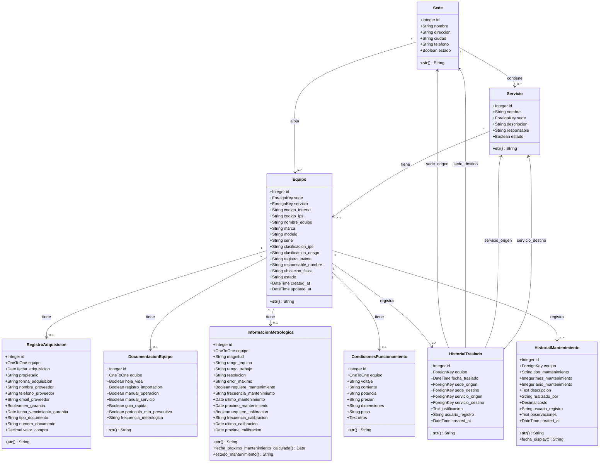
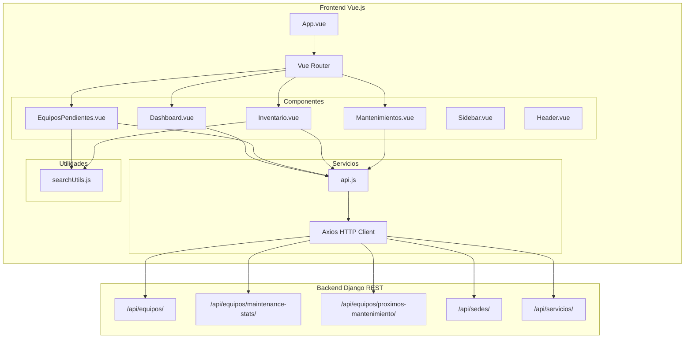
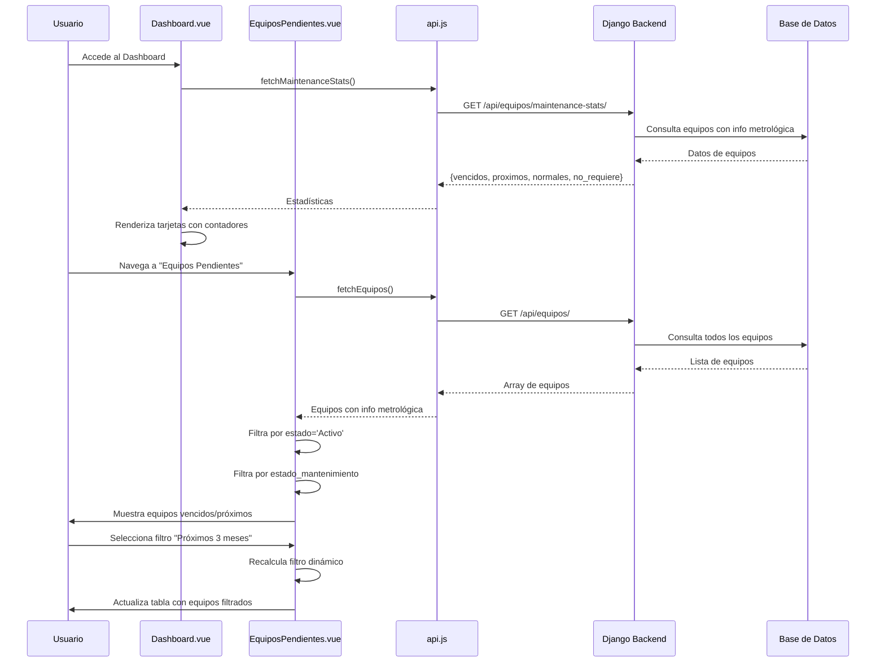
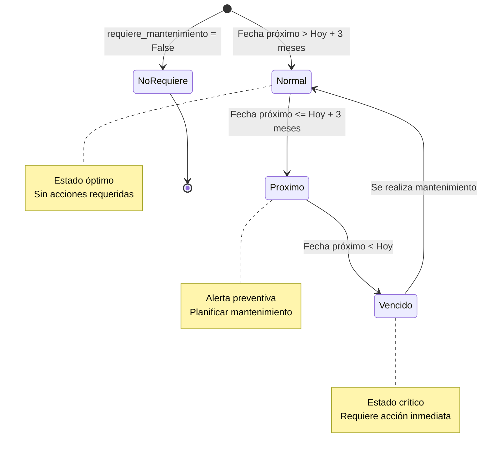
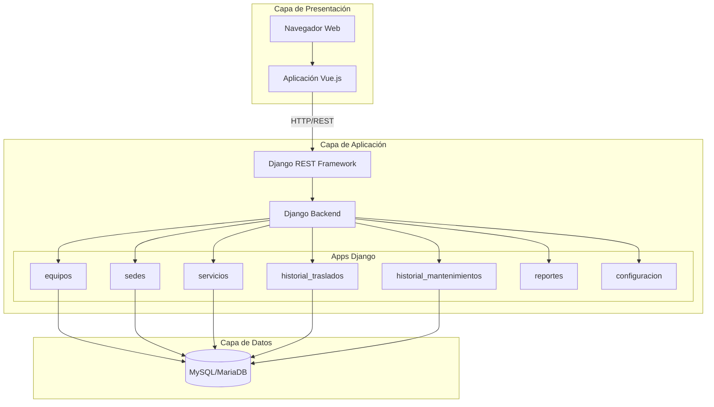

# Diagrama UML - Sistema LIME

## Diagrama de Clases del Backend

## Diagrama de Componentes del Frontend

## Diagrama de Flujo de Datos - Mantenimiento

## Diagrama de Estados del Mantenimiento

## Arquitectura General del Sistema

## Notas Importantes

### Relaciones Clave
- **Sede → Servicio**: Una sede puede tener múltiples servicios (1:N)
- **Equipo → Sede/Servicio**: Un equipo pertenece a una sede y un servicio (N:1)
- **Equipo → Modelos Relacionados**: Relación 1:1 con RegistroAdquisicion, DocumentacionEquipo, InformacionMetrologica, CondicionesFuncionamiento
- **Equipo → Historiales**: Relación 1:N con HistorialTraslado y HistorialMantenimiento

### Lógica de Negocio
- El cálculo del estado de mantenimiento se realiza en el modelo `InformacionMetrologica` mediante propiedades computadas
- Los filtros de equipos pendientes en el frontend se basan en el estado calculado por el backend
- La búsqueda avanzada normaliza texto para ignorar acentos y mayúsculas
