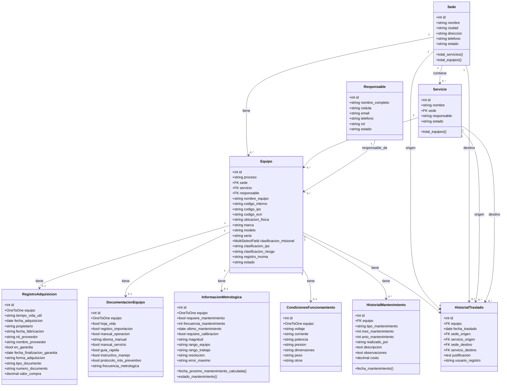
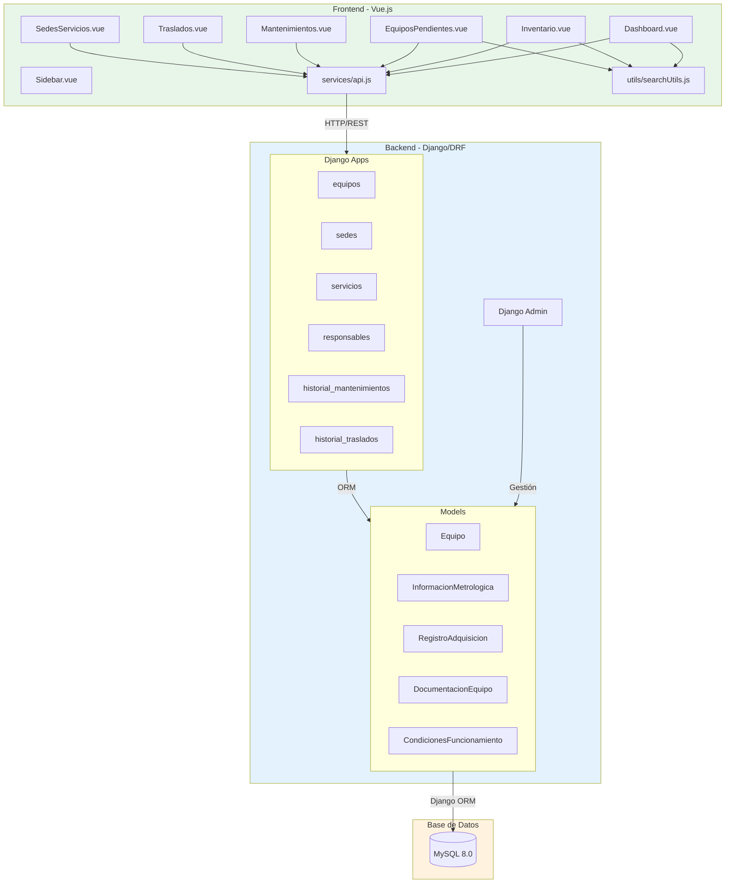
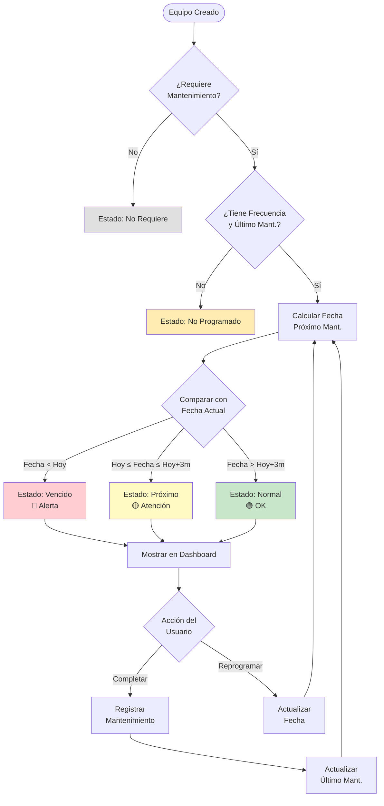
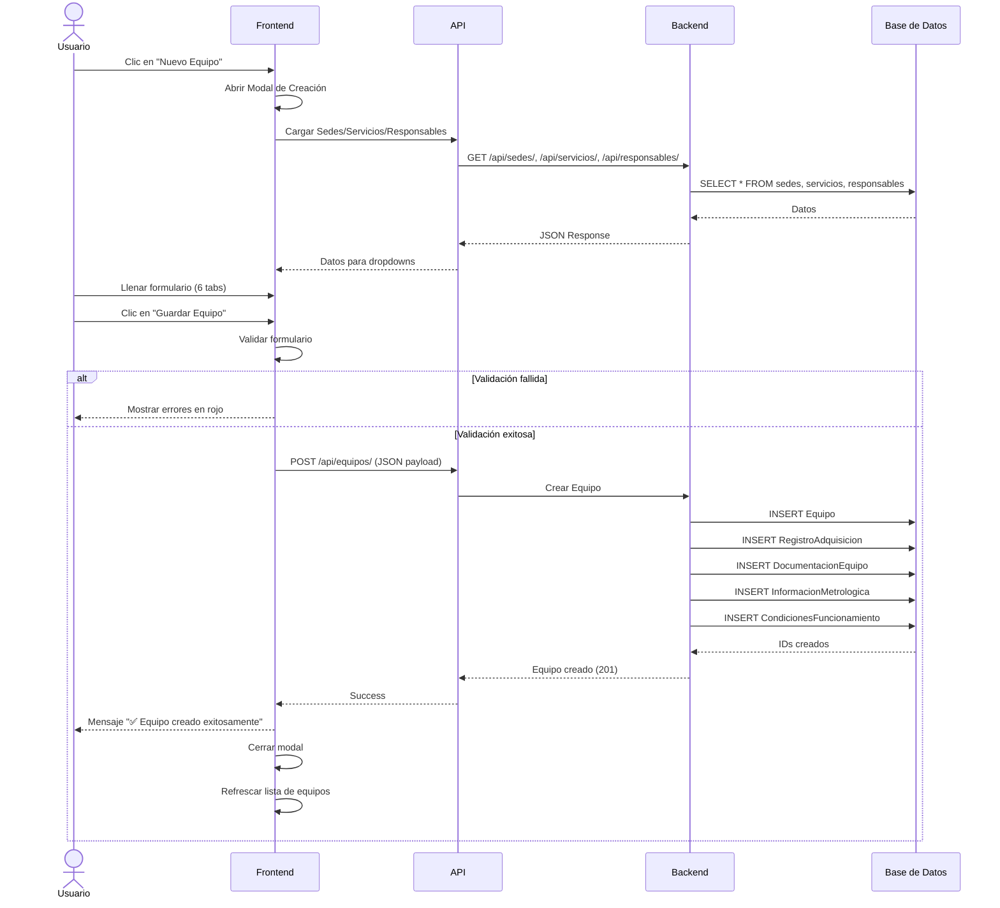
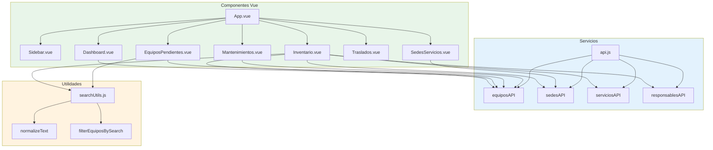

# Diagrama UML - Sistema LIME

## Diagrama de Clases del Backend

## Diagrama de Arquitectura del Sistema

## Diagrama de Flujo: Estados de Mantenimiento

## Diagrama de Secuencia: Crear Equipo

## Diagrama de Componentes: Frontend

## Notas Adicionales

### Convenciones de Nombres
- **Models**: PascalCase (Equipo, InformacionMetrologica)
- **Fields**: snake_case (codigo_interno, fecha_adquisicion)
- **Components**: PascalCase (Dashboard.vue, Inventario.vue)
- **Functions**: camelCase (normalizeText, filterEquiposBySearch)

### Relaciones Clave
1. **Sede → Servicio → Equipo**: Jerarquía organizacional
2. **Equipo → 4 modelos 1:1**: Información extendida
3. **Equipo → N historiales**: Trazabilidad temporal
4. **InformacionMetrologica**: Lógica crítica de estados

### Estados del Sistema
- **Equipos**: Activo, Inactivo
- **Mantenimiento**: Vencido, Próximo, Normal, No Requiere, No Programado
- **Tipo Mantenimiento**: Preventivo, Correctivo, Calibración, Verificación

### Flujos Principales
1. **Dashboard → EquiposPendientes**: Ver equipos que requieren atención
2. **Inventario → Modal Detalle**: Ver información completa
3. **Inventario → Modal Edición**: Modificar equipo
4. **SedesServicios → Acordeón**: Gestionar estructura organizacional
