# Diagrama UML - Sistema LIME

## Diagrama de Clases del Backend

## Diagrama de Arquitectura del Sistema

## Diagrama de Flujo: Estados de Mantenimiento

```mermaid
flowchart TD
    Start([Equipo Creado]) --> Check{¿Requiere<br/>Mantenimiento?}
    
    Check -->|No| NoReq[Estado: No Requiere]
    Check -->|Sí| HasFreq{¿Tiene Frecuencia<br/>y Último Mant.?}
    
    HasFreq -->|No| NoProg[Estado: No Programado]
    HasFreq -->|Sí| CalcFecha[Calcular Fecha<br/>Próximo Mant.]
    
    CalcFecha --> CompareDate{Comparar con<br/>Fecha Actual}
    
    CompareDate -->|Fecha < Hoy| Vencido[Estado: Vencido<br/>🔴 Alerta]
    CompareDate -->|Hoy ≤ Fecha ≤ Hoy+3m| Proximo[Estado: Próximo<br/>🟡 Atención]
    CompareDate -->|Fecha > Hoy+3m| Normal[Estado: Normal<br/>🟢 OK]
    
    Vencido --> Dashboard1[Mostrar en Dashboard]
    Proximo --> Dashboard1
    Normal --> Dashboard1
    
    Dashboard1 --> Action{Acción del<br/>Usuario}
    
    Action -->|Completar| RegMant[Registrar<br/>Mantenimiento]
    Action -->|Reprogramar| UpdateFecha[Actualizar<br/>Fecha]
    
    RegMant --> UpdateUltimo[Actualizar<br/>Último Mant.]
    UpdateUltimo --> CalcFecha
    
    UpdateFecha --> CalcFecha
    
    style Vencido fill:#ffcdd2
    style Proximo fill:#fff9c4
    style Normal fill:#c8e6c9
    style NoReq fill:#e0e0e0
    style NoProg fill:#ffecb3
```

## Diagrama de Secuencia: Crear Equipo

```mermaid
sequenceDiagram
    actor Usuario
    participant Frontend
    participant API
    participant Backend
    participant DB as Base de Datos
    
    Usuario->>Frontend: Clic en "Nuevo Equipo"
    Frontend->>Frontend: Abrir Modal de Creación
    Frontend->>API: Cargar Sedes/Servicios/Responsables
    API->>Backend: GET /api/sedes/, /api/servicios/, /api/responsables/
    Backend->>DB: SELECT * FROM sedes, servicios, responsables
    DB-->>Backend: Datos
    Backend-->>API: JSON Response
    API-->>Frontend: Datos para dropdowns
    
    Usuario->>Frontend: Llenar formulario (6 tabs)
    Usuario->>Frontend: Clic en "Guardar Equipo"
    
    Frontend->>Frontend: Validar formulario
    alt Validación fallida
        Frontend-->>Usuario: Mostrar errores en rojo
    else Validación exitosa
        Frontend->>API: POST /api/equipos/ (JSON payload)
        API->>Backend: Crear Equipo
        Backend->>DB: INSERT Equipo
        Backend->>DB: INSERT RegistroAdquisicion
        Backend->>DB: INSERT DocumentacionEquipo
        Backend->>DB: INSERT InformacionMetrologica
        Backend->>DB: INSERT CondicionesFuncionamiento
        DB-->>Backend: IDs creados
        Backend-->>API: Equipo creado (201)
        API-->>Frontend: Success
        Frontend-->>Usuario: Mensaje "✅ Equipo creado exitosamente"
        Frontend->>Frontend: Cerrar modal
        Frontend->>Frontend: Refrescar lista de equipos
    end
```

## Diagrama de Componentes: Frontend

## Notas Adicionales

### Convenciones de Nombres
- **Models**: PascalCase (Equipo, InformacionMetrologica)
- **Fields**: snake_case (codigo_interno, fecha_adquisicion)
- **Components**: PascalCase (Dashboard.vue, Inventario.vue)
- **Functions**: camelCase (normalizeText, filterEquiposBySearch)

### Relaciones Clave
1. **Sede → Servicio → Equipo**: Jerarquía organizacional
2. **Equipo → 4 modelos 1:1**: Información extendida
3. **Equipo → N historiales**: Trazabilidad temporal
4. **InformacionMetrologica**: Lógica crítica de estados

### Estados del Sistema
- **Equipos**: Activo, Inactivo
- **Mantenimiento**: Vencido, Próximo, Normal, No Requiere, No Programado
- **Tipo Mantenimiento**: Preventivo, Correctivo, Calibración, Verificación

### Flujos Principales
1. **Dashboard → EquiposPendientes**: Ver equipos que requieren atención
2. **Inventario → Modal Detalle**: Ver información completa
3. **Inventario → Modal Edición**: Modificar equipo
4. **SedesServicios → Acordeón**: Gestionar estructura organizacional
